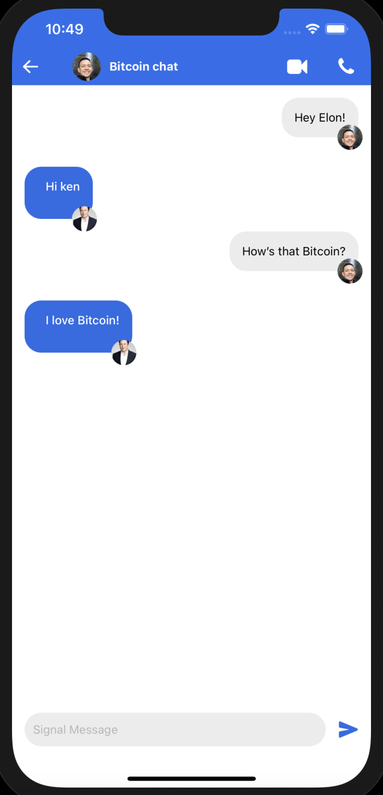

# Signal Clone

## Description

Chat with friends and family with this signal clone built using react native. 

## Table of Contents

- [Description](#description)
- [Technology](#technology)
- [User Story](#user-story)
- [Installation](#installation)
- [Usage](#usage)
- [License](#license)
- [Contributing](#contributing)
- [Tests](#tests)
- [Questions](#questions)
- [Deployed Application URL](#deployed-application-URL)

## Technology

- React Native
- React Hooks
- Firebase (user authentication/hosting)
- Expo.io

## User Story

## Installation

No installation needed

## Usage

Login to an existing account or register a new account. On the homechat screen, click on any existing chat to enter chat room and start chatting. To create a new chat, click on the upper right pencil icon. Click on create new chat and click on the chat name to start chatting. Click on avatar on the upper left to sign out.

## License

## Contributing

Please follow standard contributing guidelines.

## Tests

No tests to run.

## Questions

For any questions, please contact kendayao at kendayao@gmail.com

## Deployed Application URL

Deployed web application link: https://signal-clone-53de0.web.app

Video demo link: 

